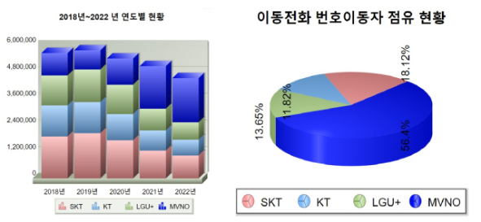

## 통신사 고객 이탈 예측 프로젝트 

### 프로젝트 개요 

한국 이동통신 업계에서의 고객 이탈 문제는 알뜰폰의 등장 이후 더욱 심각해지고 있습니다. 최근 한국통신사업자연합회(KTOA)의 데이터에 따르면, 3개 주요 통신사에서 알뜰폰으로 번호 이동한 고객 수가 급증하여, 통신사들의 시장 점유율은 모두 감소하였습니다. 이로 인해 우리 프로젝트는 통신사의 주요 고객 이탈 원인을 파악하고, 경쟁력 확보와 지속적인 성장을 위한 효과적인 마케팅 전략 수립을 목표로 합니다.

 

 